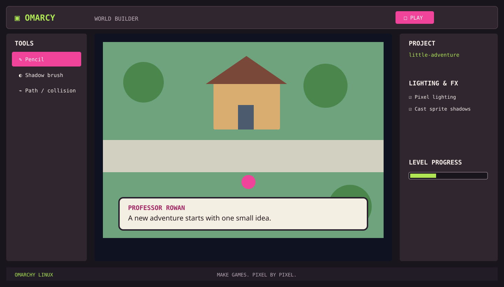

<div align="center">

# OMARCHY Studio

### Build games. Learn naturally. Pixel by pixel.

[](https://github.com/neshath/omarchy-studio/actions/workflows/ci.yml)
[](https://www.rust-lang.org/)
[](LICENSE)

</div>



OMARCHY Studio is a native, open-source pixel game editor for Omarchy Linux. It is designed to grow with the creator: a child can start with a pencil and Play button, while an advanced user can progressively unlock tilemaps, animation, lighting, visual logic, scripting, and plugins.

This repository is the **Game Editor Beta** proposal: a focused, working editor shell that proves the adaptive workspace and the first creation loop. It is intentionally honest about what is implemented and what is staged next.

OMARCHY Studio is inspired by beginner-friendly game makers, pixel-art editors, fantasy-console immediacy, and handheld RPG map/dialogue workflows. It does not ship third-party game assets or present a mockup as a finished runtime.

## Current beta slice

- Native Rust desktop window powered by `eframe`/`egui` with the `wgpu` renderer.
- Sprite Lab / World Builder / Visual Logic workspace switching.
- Canvas preview with a crisp pixel-scene composition, frame controls, playback, onion-skin toggle, zoom, and tool cursor.
- World Builder map preview with overworld, town, and interior map styles, chunk grid, terrain, houses, objects, and layer guidance.
- Dialogue box authoring and preview with editable speaker and line fields, ready for portraits, choices, and event hooks.
- Character Workshop foundation with direction/animation setup and a character preview canvas.
- Lighting & FX foundation with pixel lights, ambient level, shadow toggle, radius, and particle density controls.
- Beginner-friendly tool rail, layers, palette, project status, asset browser, and unlock path.
- Creator level model with a clear progression from sprite painting to plugins.
- Local-first project model ready to grow into a Git-friendly on-disk format.

## Install on Omarchy / Linux

Requires a recent stable Rust toolchain and the Linux graphics/windowing development libraries used by `wgpu`/`winit`.

```sh
git clone https://github.com/neshath/omarchy-studio.git
cd omarchy-studio
cargo run --locked
```

Build a release binary:

```sh
cargo build --release --locked
./target/release/omarchy-studio
```

Install for the current user:

```sh
make install
```

This installs the binary into `~/.local/bin`, registers a desktop launcher, and installs the icon. Use `PREFIX=/usr/local sudo make install` for a system-wide install. Remove it with `make uninstall`.

## Editor workflow

| Action | Control |
| --- | --- |
| Play / pause preview | `PLAY` button or animation controls |
| Switch workspace | `SPRITE`, `WORLD`, `LOGIC`, `CHARACTER`, `FX` |
| Toggle dialogue preview | `DIALOGUE` button or inspector checkbox |
| Choose map style | World Builder → Overworld / Town / Interior |
| Tune lighting | Lighting & FX → ambient / radius / particle sliders |
| Choose a painting or world tool | Left tool rail |

## Verification before a release

```sh
cargo fmt --all -- --check
cargo test --locked
cargo clippy --locked --all-targets --all-features -- -D warnings
cargo build --release --locked
```

GitHub Actions runs these checks on pushes and pull requests.

## Design direction

The beta follows the supplied Omasprite-style reference: dark graphite chrome, chunky monospace controls, hot magenta and violet accents, lime progress signals, and a large scene-first canvas. See [PRODUCT.md](PRODUCT.md), [docs/ARCHITECTURE.md](docs/ARCHITECTURE.md), and [docs/ROADMAP.md](docs/ROADMAP.md).

## Contributing

See [CONTRIBUTING.md](CONTRIBUTING.md). Contributions should preserve local-first behavior, progressive disclosure, keyboard access, and the distinction between an implemented feature and a roadmap item.

## Project map

- `src/app.rs` — native window, workspace composition, and canvas previews.
- `src/model.rs` — project, tools, workspaces, and progression data.
- `src/ui.rs` — tool rail, inspector, dialogue, map, and effects controls.
- `docs/ARCHITECTURE.md` — module boundaries and data contract.
- `docs/ROADMAP.md` — beta milestones and implementation boundary.
- `packaging/` — Linux desktop launcher metadata.

## License

GPL-3.0-or-later. See [LICENSE](LICENSE).
